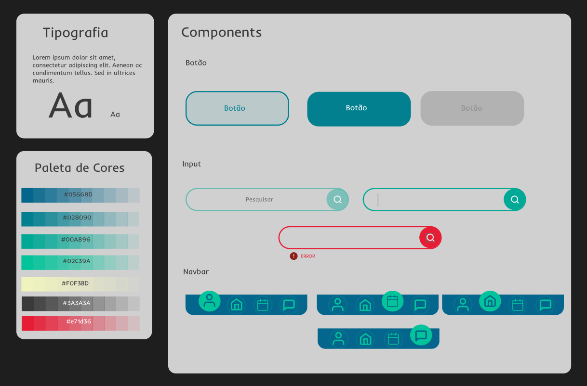
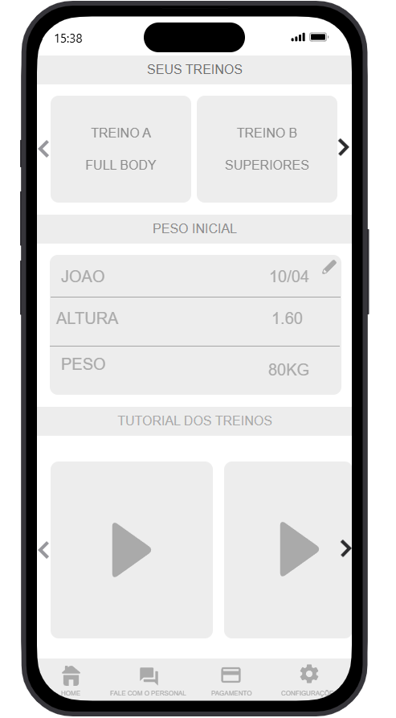

# App de Consultoria para Personal Trainer – Protótipo (Proto.io)

Protótipo de **alta fidelidade** desenvolvido no **Proto.io**, com foco na **tela inicial (Home)** de um aplicativo voltado para **personal trainers e seus clientes**.

O projeto tem como objetivo validar a experiência inicial do usuário, identidade visual e estrutura de layout antes da implementação em código.

---

## 📌 Escopo do Projeto

Atualmente, o projeto contempla **apenas a tela Home**, desenvolvida para:

- Explorar layout e hierarquia visual  
- Definir identidade visual do aplicativo  
- Validar a primeira experiência do usuário  
- Servir como base para futuras implementações em front-end  

> As demais telas e funcionalidades poderão ser desenvolvidas futuramente.

---

## 🎯 Objetivo

Criar uma **tela inicial clara, intuitiva e visualmente agradável**, que represente bem a proposta do aplicativo e facilite a navegação inicial do usuário.

---

## 🖥️ Tela Desenvolvida

- Home

---

## 🎨 Design System

O projeto conta com um **Design System criado no Figma**, que define os padrões visuais e componentes utilizados no protótipo.

### Inclui:
- Paleta de cores  
- Tipografia  
- Componentes (botões, cards, inputs)  
- Hierarquia visual  
- Diretrizes de uso  

🔗 **Acesse o Design System no Figma:**  
👉 https://www.figma.com/design/AXqNayu5du1at4tK77102B/Untitled?node-id=0-1&t=ZtYJAVgGKGR2axOR-1

> Este design system servirá como base para a futura implementação em React / React Native.

---

## 📷 Preview

---

## 🔗 Protótipo Interativo

Acesse o protótipo no Proto.io:  
👉 https://pr.to/6VJ5C9/

---

## 🛠️ Ferramenta Utilizada

- Proto.io  
- Figma

---

## 📷 Preview

---

## 📌 Observações

Este repositório contém **apenas o protótipo visual**, não possuindo código implementado até o momento.  
O foco do projeto está na **UX/UI e planejamento visual**.

---

## 🚀 Próximos Passos (Planejados)

- Expansão para outras telas do aplicativo  
- Implementação do design em código  
- Criação da versão mobile (React Native)  
- Integração com backend futuramente
